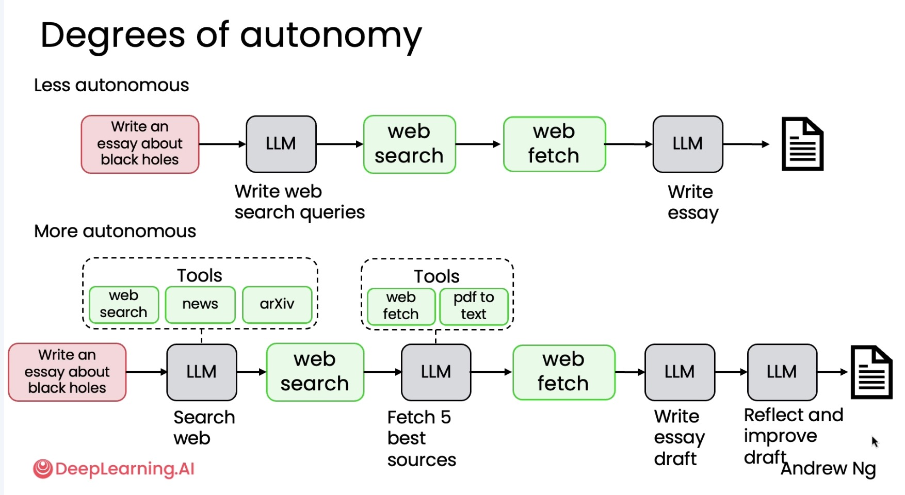

## 1. What is Agentic AI Workflow

An agentic AI workflow is a process where an LLM-based app executes multi-step to complete a task 

    Example of Essay-writing:
        - Write an essay outline on topic
        - Do you need any web research
        - Write a first draft
        - Consider what parts need review
        - Download an essay and feed it to LLM
        - Human Review(if needed)
        - Revise your draft 

## 2. Degree of Autonomy

| Degree                | Characteristics                                                                         |
| --------------------- | --------------------------------------------------------------------------------------- |
| **Less autonomous**   | All steps predetermined; All tool use hard-coded; Autonomy is in text generation. |
| **Semi-autonomous**   | Agent can make some decisions and choose tools; All tools predefined.                |
| **Highly autonomous** | Agent makes many decisions autonomously; Can create new tools on the fly. (note: its also less controllable and predictable as well)           |
