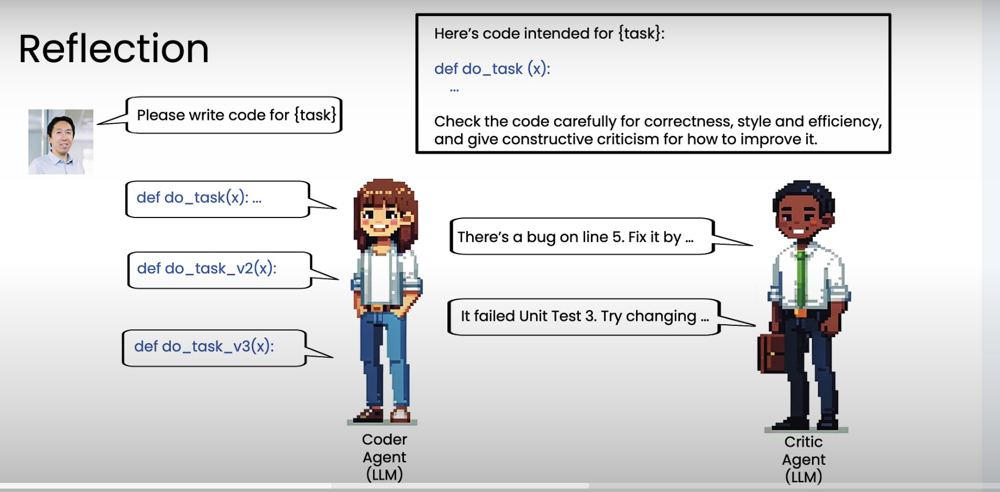
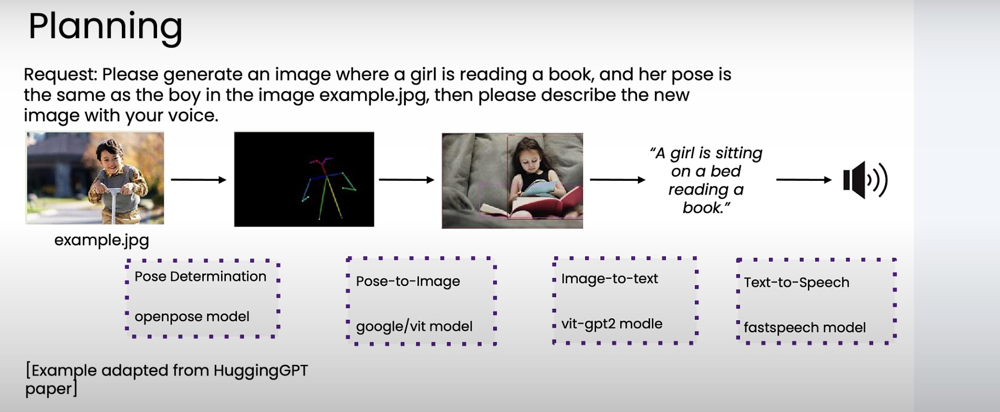

## 1. What is Agentic AI Workflow

An agentic AI workflow is a process where an LLM-based app executes multi-step to complete a task 

    Example of Essay-writing:
        - Write an essay outline on topic
        - Do you need any web research
        - Write a first draft
        - Consider what parts need review
        - Download an essay and feed it to LLM
        - Human Review(if needed)
        - Revise your draft 

## 2. Degree of Autonomy

| Degree                | Characteristics                                                                         |
| --------------------- | --------------------------------------------------------------------------------------- |
| **Less autonomous**   | All steps predetermined; All tool use hard-coded; Autonomy is in text generation. |
| **Semi-autonomous**   | Agent can make some decisions and choose tools; All tools predefined.                |
| **Highly autonomous** | Agent makes many decisions autonomously; Can create new tools on the fly. (note: its also less controllable and predictable as well)           |

## 3. Benefits of Agentic Workflow:
    - Run multi task concurrently, time efficiency
    - Much better performance
    - Modular: can add or updates tools, swap out models 

## 4. What taks is/isn't Agentic AI suited to:
    
    What's good for Agentic AI:
        - Clear, step-by-step process
        - Text assets only
        - Standard procedures to follow
    
    What's not suitable for Agentic AI:
        - Steps not known ahead of time
        - Plan/solve as you go 
        - Mutilmodal (sounds, videos, images) are usually less predictable 

## 5. Task Decomposion 

Steps of designing Agentic Workflow
1. Turn task into a bunch of sequences 
2. Determind each sequence can be done with either Models or Tools
3. If not, how would myself as human solve this task
4. Is it possible to decompose this task into smaller pieces and solve them with agentic workflow

| Building block | Examples              | Use cases                                                     |
| -------------- | --------------------- | ------------------------------------------------------------- |
| Models         | LLMs                  | Text generation, tool use, information extraction             |
| Models         | Other AI models       | PDF-to-text, text-to-speech, image analysis                   |
| Tools          | API                   | Web search, get real-time data, send email, check calendar…  |
| Tools          | Information retrieval | Databases, Retrieval-Augmented Generation (RAG)               |
| Tools          | Code execution        | Basic calculator, data analysis                               |

## 6. Evaluating Agentic AI

1. Look for low-quality output
2. Add an evaluation to track error (e.g. write code to check occurence of certain error, or using another LLM as judge)
    - two types of eval: End-to-End and component-level

## 7. Agentic Design Pattern

### 1. Reflection  
Reflection allows an agent to review and evaluate its own past actions or outputs.  
This helps improve reasoning quality and reduce repeated mistakes in multi-step workflows.  

---

### 2. Tool Use  
Tool use enables the agent to call external APIs or functions to extend its capabilities beyond text generation.  
It bridges reasoning with action — letting the agent fetch data, perform computations, or trigger workflows.  

---

### 3. Planning  
Planning lets the agent autonomously decide the order and structure of its subtasks.  
This gives more flexibility but reduces control, as the agent dynamically adjusts its plan during execution.  

---

### 4. Multi-Agent Collaboration  
Multi-agent collaboration involves multiple specialized agents communicating and coordinating to achieve a shared goal.  
Research shows that this pattern often leads to better performance through division of labor and collective reasoning.  
