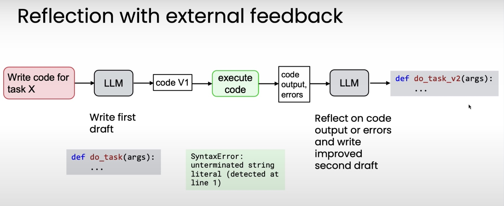
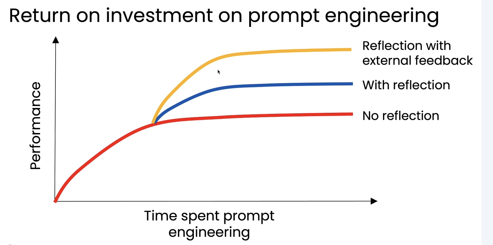

# 1. Reflection to Improve Task Outputs

Reflection involves reviewing and refining generated outputs to make them more accurate, coherent, and aligned with requirements.



**Note:** Reflection becomes more powerful when the model can incorporate **additional external information** during the refinement process.


---

# 2. Why Not Rely on Direct Generation?

Zero-shot (direct) generation often produces lower-quality results compared to reflection-based workflows.

### Prompting Styles

| Prompting Style        | Description                                               | Example Provided? | Example Format                                                                 |
|------------------------|-----------------------------------------------------------|-------------------|--------------------------------------------------------------------------------|
| **Zero-shot**          | Model follows instructions with no examples               | No                | “Convert to MM/DD/YYYY format. Input: {input_date}”                            |
| **One-shot**           | Model learns from a single example                        | 1 example         | Input: “Jan 1st, 2025” → “01/01/2025” → Then process {input_date}              |
| **Few-shot / Two-shot**| Model generalizes from multiple examples                  | 2+ examples       | Includes multiple input-output pairs before processing {input_date}            |

### When Reflection Works Well

| Example Task                     | Common Problem Identified                                      | Helpful Reflection Prompt                                                                 |
|----------------------------------|----------------------------------------------------------------|--------------------------------------------------------------------------------------------|
| Generate HTML table              | Syntax errors (e.g., missing `>`)                              | “Validate the HTML code.”                                                                  |
| How to brew a perfect cup of tea | Steps may be missing or unclear                                | “Check instructions for coherence and completeness.”                                       |
| Generating domain names          | Names may be hard to pronounce or have unintended meanings     | “Does the name have negative connotations? Is it easy to pronounce and remember?”         |


---

# 3. Chart Generation Workflow

Different LLMs excel at different tasks.  
You may choose **one model to generate** a chart and **another to reflect** and improve clarity.

**Note:** Reasoning-enabled models generally perform *better* during reflection.


---

# 4. Evaluating the Impact of Reflection

When comparing **with vs. without reflection**:

- **Objective tasks** can be checked against correct answers.
- **Subjective tasks** may require an LLM as a judge — but with caution:

  **Common Issues Using LLMs as Judges**
  - Answers can be inconsistent
  - Judges display *position bias*

**More reliable approach: Evaluate using a structured rubric.**

Example rubric prompt:
```
Assess the attached image against this quality rubric.
Each item should receive a score of 1 (true) or 0 (false).
Return the scores as a JSON object.

1. Has clear title
2. Axis labels present
3. Appropriate chart type
4. Axes use appropriate numerical range
5. ...
```

---

# 5. Using External Feedback

Reflection can also use **additional external tools** as feedback sources.



| Challenge                               | Example                                           | Source of Feedback                |
|-----------------------------------------|---------------------------------------------------|-----------------------------------|
| Mentioning competitors                  | “Our company’s shoes are better than RivalCo.”    | Pattern matching competitor names |
| Fact checking an essay                  | “The Taj Mahal was built in 1648.”                | Web search results                |
| LLM not following output length limits  | Essay is over word count                           | Word count tool                   |

