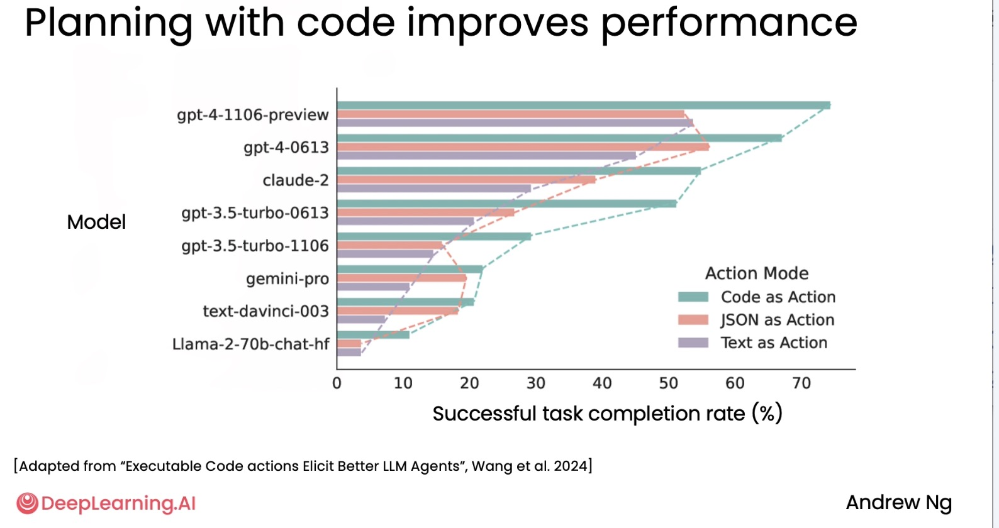
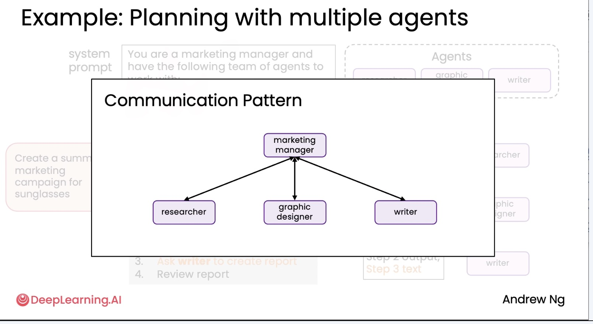
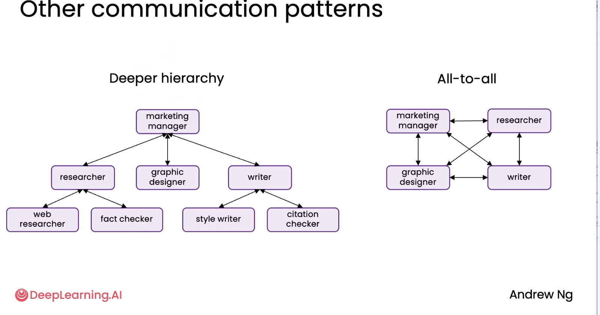

# 1. Planning workflows 

## Planning Example: Customer Service Agent

**User Request:**  
> *"Do you have any round sunglasses in stock that are under $100?"*

**Available Tools:**
- `get_item_descriptions` — retrieve product descriptions based on keywords
- `check_inventory` — check stock availability
- `get_item_price` — retrieve pricing information
- `process_item_return`
- `check_past_transactions`
- `process_item_sale`

---

### Step-by-Step Plan (Generated by LLM)

1. **Find relevant products**  
   Use `get_item_descriptions` to search for **round sunglasses**.

2. **Check availability**  
   Use `check_inventory` to determine which of the found items are **in stock**.

3. **Check pricing**  
   Use `get_item_price` to filter the **in-stock items** to those that cost **less than $100**.

Note you can use JSON or XML here to format plan and insert it into prompt

---

### Execution Flow

| Step | LLM Action Input | Tool Used | Output Used For Next Step |
|------|------------------|----------|---------------------------|
| 1 | User query | `get_item_descriptions` | List of round sunglasses |
| 2 | Step 1 results | `check_inventory` | In-stock round sunglasses |
| 3 | Step 2 results | `get_item_price` | Final filtered list (< $100) |


## Planning Example: Email Assistant

**User Request:**  
> *"Reply to that email invitation from Bob about dinner in New York and tell him I’ll attend. Then archive his email."*

**Available Tools:**
- `search_email` — locate specific emails using keywords or sender info
- `send_email` — send an email response
- `move_email` — move an email to another folder (e.g., archive)
- `delete_email`

---

### Step-by-Step Plan (Generated by LLM)

1. **Find the invitation email**  
   Use `search_email` to locate emails from **"Bob"** that mention **"dinner"** and **"New York"**.

2. **Send a reply**  
   Use `send_email` to reply to the found message and confirm attendance.

3. **Archive the email**  
   Use `move_email` to move the original email to the **archive folder**.

---

### Execution Flow

| Step | LLM Action Input | Tool Used | Output Used For Next Step |
|------|------------------|----------|---------------------------|
| 1 | User request | `search_email` | Email thread from Bob |
| 2 | Step 1 result + reply text | `send_email` | Confirmation sent |
| 3 | Step 2 result + archive instruction | `move_email` | Email stored in archive |


# 2. Planning with code execution

Instead of adding tools to LLM, we can ask LLM to write code.
## Planning with Code Execution

**System Prompt:**  
> *Write code to solve the user's query. Return your answer as python code delimited with `<execute_python>` and `</execute_python>`.*

**User Request:**  
> *"What were the amounts of the last 5 transactions?"*

---

### LLM Plan & Execution

The LLM generates Python code that:

1. **Loads** the CSV file containing transaction data.
2. **Parses** the date column to ensure proper sorting.
3. **Sorts** the transactions by date (most recent first).
4. **Selects** the last 5 transactions.
5. **Extracts** and prints only their **amounts**.

---

### Example Code Returned by the LLM

```python
<execute_python>
import pandas as pd

# Load CSV
df = pd.read_csv("transactions.csv")

# Ensure date column is parsed as datetime
df["date"] = pd.to_datetime(df["date"])

# Sort by date to get most recent transactions
df_sorted = df.sort_values(by="date", ascending=False)

# Select the last 5 transactions
last_5 = df_sorted.head(5)

# Show just the price column (amounts)
print("Last 5 transaction amounts:")
print(last_5["price"].to_list())
</execute_python>
```

<p align="center">
  
</p>


# 3. Multi-agentic workflows
## Example: Marketing Team with a Multi-Agent Workflow

**Goal:**  
> *Create a summer marketing campaign for sunglasses.*

This workflow is **multi-agent** — each **purple box represents an autonomous agent** with a specific role.

---

### Agents & Responsibilities

| Agent | Role | Output |
|------|------|--------|
| **Researcher Agent** | Gathers market insights | Current sunglasses trends, competitor offerings |
| **Graphic Designer Agent** | Produces visuals and artwork | 5 data visualizations + 5 campaign artwork options |
| **Writer Agent** | Writes final campaign materials | Completed final marketing report |

---

### Linear Workflow

1. **Start:** Campaign request is initiated.
2. **Researcher Agent** collects trend data and competitor analysis.
3. **Graphic Designer Agent** uses research to create visual assets (charts, product imagery).
4. **Writer Agent** receives research + visuals and composes the final report.

---

### Final Output
- A polished **summer marketing campaign report** containing:
  - Market insights
  - Visual data presentations
  - Artwork and creative elements

# 4. Communication patterns for multi-agent systems

### **1. Linear Pipeline Structure**

researcher --> graphic designer --> writer 
  |__________________________________|


This pattern is simple and efficient when tasks clearly flow from one role to the next.

---

### **2. Manager-Coordinated Structure**

A central **manager agent** coordinates communication among specialized agents:

<p align="center">
  
</p>

This works well when planning, delegation, or task oversight is needed.

---

### **3. Hierarchical / Multi-Layer Structure**

Agents are organized in multiple layers, where senior agents supervise groups of sub-agents:

<p align="center">
  
</p>

This pattern supports large, complex workflows and scalable team organization.

---
