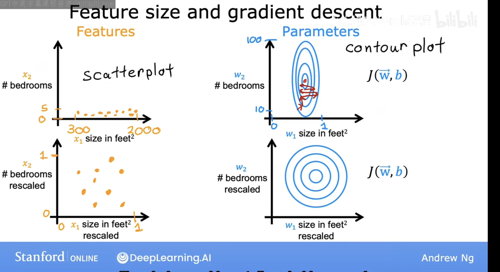
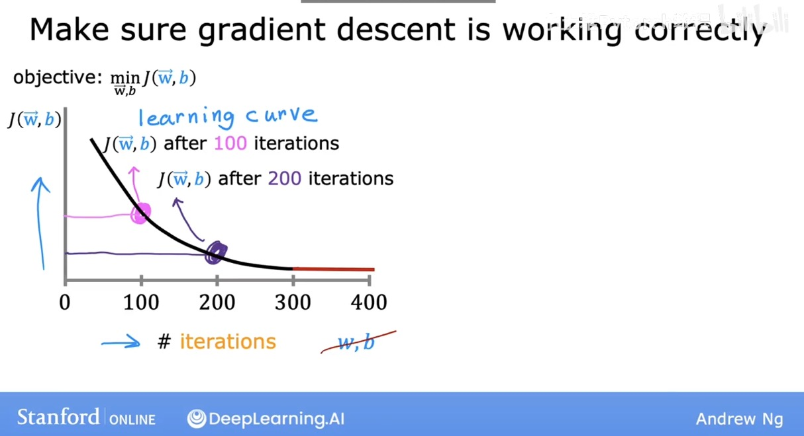

# **1. What is Feature Scaling**

Feature scaling is the process of transforming numerical features so they exist on a similar scale.  
This is important because many machine learning algorithms behave poorly when features have very different magnitudes.

For example, suppose we have two variables:

- \( x = 3000 \)
- \( y = 0.01 \)

In this situation, the model may treat **\(x\)** as far more important simply because its value is larger — not because it truly has more predictive power. This imbalance can lead to:

- Slow or unstable gradient descent  
- Poor convergence  
- Distorted distance metrics (important for KNN, K-means, etc.)  
- Model coefficients dominated by large-scale features (e.g., linear/logistic regression)

To solve this, we apply **feature scaling**, which ensures all features contribute more fairly.

---

## **Common Feature Scaling Methods**

### **1. Standardization (Z-score Normalization)**  
Transforms data to have mean 0 and standard deviation 1:

$$
x' = \frac{x - \mu}{\sigma}
$$

---

### **2. Min–Max Scaling**  
Maps each feature to the range [0, 1]:

$$x' = \frac{x - x_{\min}}{x_{\max} - x_{\min}}$$

---

### **3. Mean Normalization **  

$$ x' = \frac{x - \mu}{x_{\max} - x_{\min}}$$

# **2.How to Determine Convergence**

## 1. Drawing a Learning Curve
This is the diagram of learning curve:

Here when the slope tends to be horizontal, it's likely cost function has converged at that point

## 2. Automatic Convergence Test
let a parameter $\epsilon = 10^{-3}$, if cost function decreases by less or equal to $\epsilon$ by one itertation, it's likely that cost function has converged

# 3. Feature Engineering

**Definiton**: using intuition to design new features, by **transforming** or **combining** original features