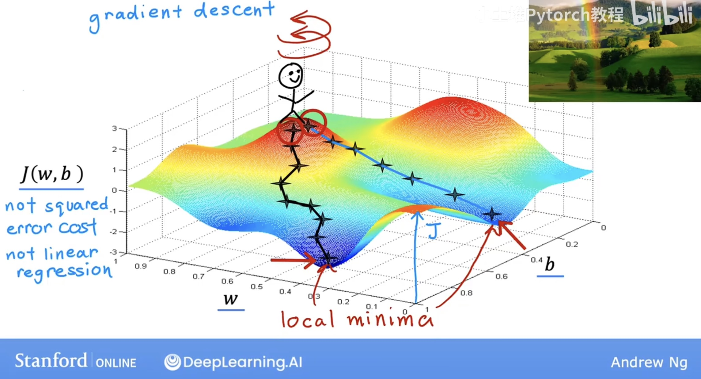
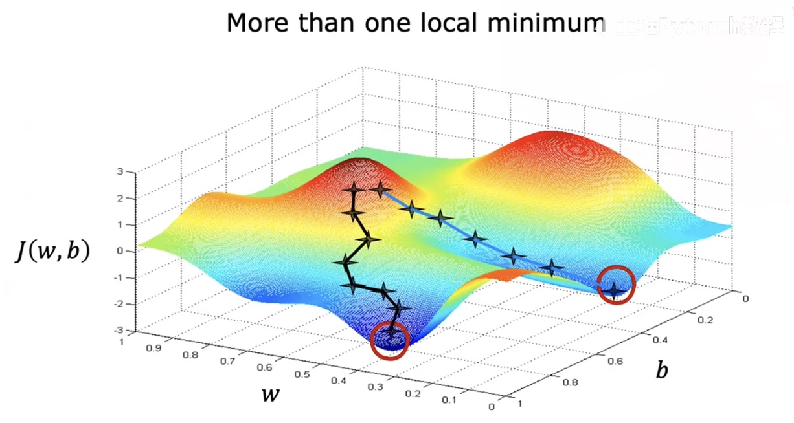
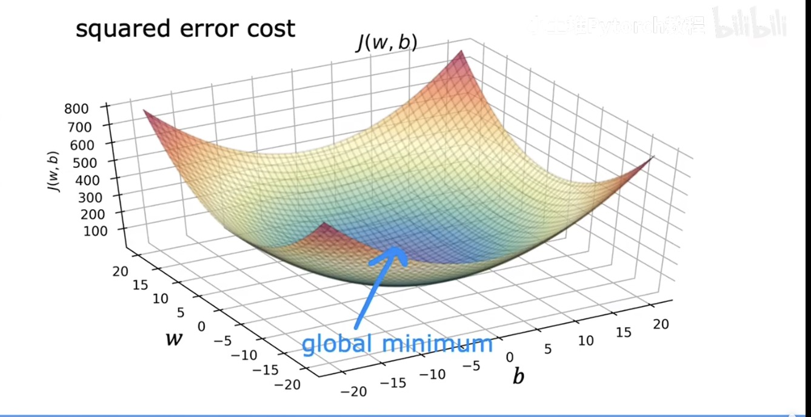

# 1. What is Linear Regression
A supervised learning algorithm that models the relationship between an input **x** and an output **y** using a **straight line**.

Goal:  
Find the best-fitting line  
$$
f_{w,b}(x) = wx + b
$$
that minimizes the difference between predicted values and actual values.

Key idea:  
Assumes **y changes linearly with x**.

Used for:  
- Predicting continuous values (price, temperature, sales, etc.)
- Understanding how variables are related

# 2. Cost Function of Linear Regression

Squared error cost function:

$$
J(w,b) = \frac{1}{2m}\sum_{i=1}^{m} \left( \hat{y}^{(i)} - y^{(i)} \right)^2
$$

where
$$
\hat{y}^{(i)} = f_{w,b}(x^{(i)})
$$
Note here we use 1/2m since the 1/2 will be cancelled later when doing derivative in gradient descent

Goal: find w, b to minimize $$J(w,b)$$

# 3. Gradient Descent
Compute:
$$
w \;=\; w \;-\; \alpha \,\frac{\partial}{\partial w} J(w,b)
$$
$$
b \;=\; b \;-\; \alpha \,\frac{\partial}{\partial b} J(w,b)
$$
Until convergence, here **alpha refers to learning rate**

Note this two formulas work for any loss function

**Make sure update w, b simultaneously:**

First compute:

$$
tmp_w \; = \; w \;-\; \alpha \,\frac{\partial}{\partial w} J(w,b)
$$
$$
tmp_b \;=\; b \;-\; \alpha \,\frac{\partial}{\partial b} J(w,b)
$$

Then:set w = tmp_w and b = tmp_b

## For linear regression:
$$
\frac{\partial}{\partial w} J(w,b)
= \frac{1}{m} \sum_{i=1}^{m} \left( f_{w,b}(x^{(i)}) - y^{(i)} \right) x^{(i)}
$$
$$
\frac{\partial}{\partial b} J(w,b)
= \frac{1}{m} \sum_{i=1}^{m} \left( f_{w,b}(x^{(i)}) - y^{(i)} \right)
$$

## Potential Problems:
- It's possible to reach local minimum instead of global minimum 

- if we use squared error function: solved. Since there's only one minimum -- convex function

## Choice of learning rate 

- if we choose learning rate too small: gradient descent slow
- if we choose learning rate too large: may overshoot / never reach minimum / diverge

# 4. Vectorization and Multiple Features