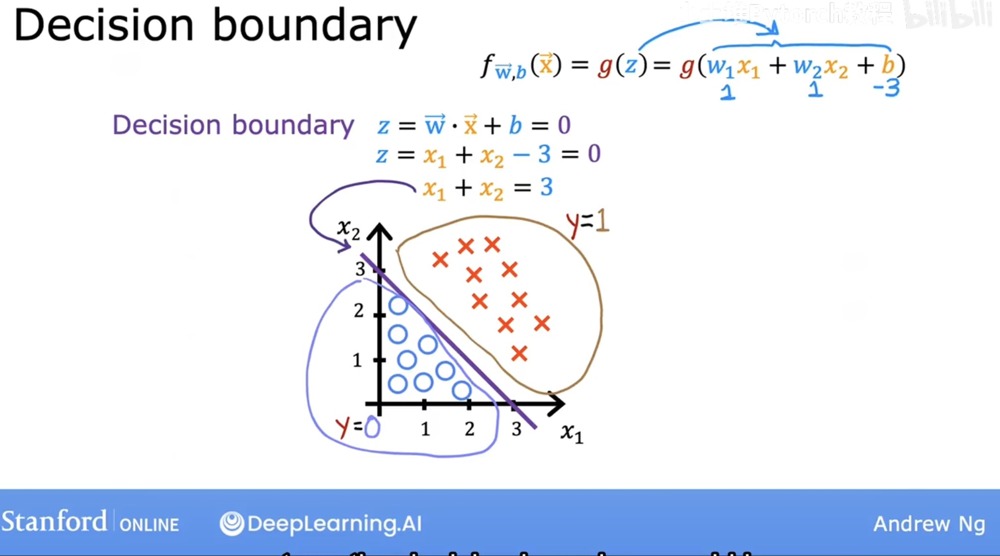
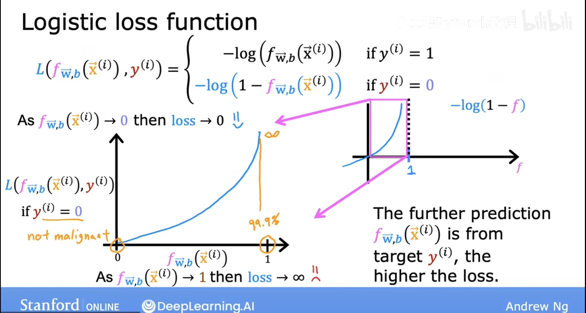
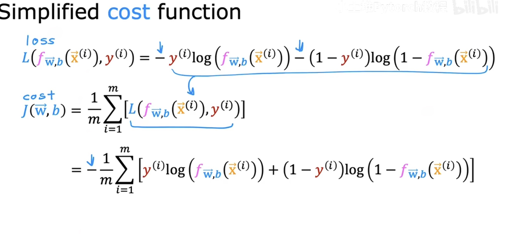
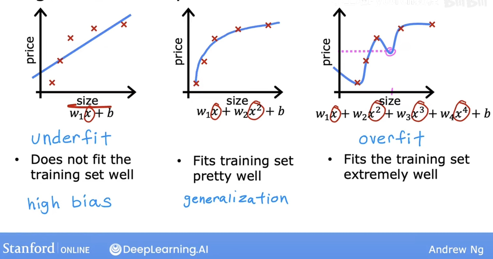

# 1. Logistic Regression

### 1. The Sigmoid Function
The logistic regression model relies on the sigmoid function $g(z)$ to map predictions to a probability range of $(0,1)$.
$$g(z) = \frac{1}{1+e^{-z}}$$

### The Model Hypothesis
$$f_{\vec{w},b}(\vec{x}) = g(\vec{w}\cdot\vec{x} + b) = \frac{1}{1+e^{-(\vec{w}\cdot\vec{x}+b)}}$$

**Interpretation:** The output is the probability that $y=1$ given input $x$.

For example, if the output = 0.7, it means there is 70% chance that y = 1

**Property:** $P(Y=0) + P(Y=1) = 1$.

### 2. Decision Boundary

A threshold is set to make a classification decision. The boundary is defined where $z=0$.

* **Linear case:** $z = \vec{w}\cdot\vec{x} + b = 0$.
* **Polynomial case:** $z = x_1^2 + x_2^2 - 4 = 0$ (defines a circular boundary).

  

## 3. Cost Function

### Logistic Loss Function
The loss for a single training example depends on the true label $y$:
* If $y=1$: Loss $= -\log(f_{\vec{w},b}(\vec{x^{i}}))$
* If $y=0$: Loss $= -\log(1 - f_{\vec{w},b}(\vec{x^{i}}))$

  

### Simplified Cost Equation
The cost function $J(\vec{w},b)$ sums the loss over all $m$ examples:
$$J(\vec{w},b) = -\frac{1}{m}\sum_{i=1}^{m} \left[ y^{(i)}\log(f_{\vec{w},b}(\vec{x}^{(i)})) + (1-y^{(i)})\log(1-f_{\vec{w},b}(\vec{x}^{(i)})) \right]$$

  

---

# 2. Overfitting & Regularization

## 1. Fitting Categories
* **Underfitting (High Bias):** The model does not fit the training data well.
* **Generalization:** The model fits the training data "just right" and works on new data.
* **Overfitting (High Variance):** The model fits the training data extremely well but fails to generalize.

  

## 2. Addressing Overfitting
1.  **Collect more data**.
2.  **Feature Selection:** Manually select features to include/exclude (Risk: useful features might be lost).
3.  **Regularization:** Keep all features but reduce the magnitude of parameters $w_j$ (not b) to prevent overly large effects.

## 3. Regularization Math

### Regularized Cost Function
We add a penalty term to the standard cost function, then it's less likely to overfit
* **Linear Regression Example:**
  $$J(\vec{w},b) = \frac{1}{2m}\sum_{i=1}^{m}(f_{\vec{w},b}(\vec{x}^{(i)}) - y^{(i)})^2 + \frac{\lambda}{2m}\sum_{j=1}^{n}w_j^2$$

* **Logistic Regression Example:**
  $$J(\vec{w},b) = \text{OriginalLoss} + \frac{\lambda}{2m}\sum_{j=1}^{n}w_j^2$$

* **Note:** $\lambda$ is the regularization parameter. If $\lambda$ is extremely large, $w_j \approx 0$, leading to underfitting ($f(x) \approx b$).

### Regularized Gradient Descent
We update the weights $w_j$ by subtracting the derivative of the cost function. The derivative now includes the regularization term.

* **Weight Update ($w_j$):**
  $$w_j = w_j - \alpha \left[ \frac{1}{m}\sum_{i=1}^{m}(f_{\vec{w},b}(\vec{x}^{(i)}) - y^{(i)})x_j^{(i)} + \frac{\lambda}{m}w_j \right]$$

* **Bias Update ($b$):** (The bias $b$ is **not** regularized)
  $$b = b - \alpha \left[ \frac{1}{m}\sum_{i=1}^{m}(f_{\vec{w},b}(\vec{x}^{(i)}) - y^{(i)}) \right]$$