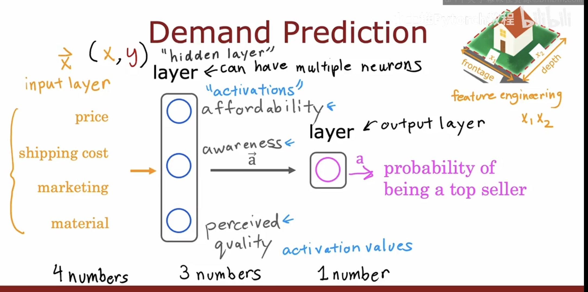
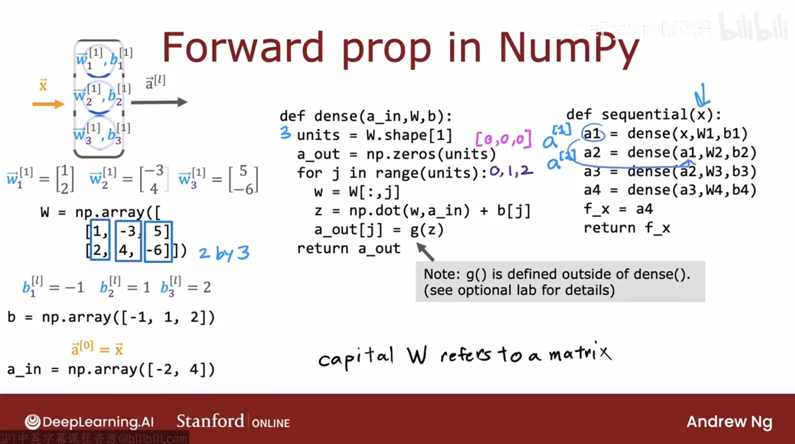
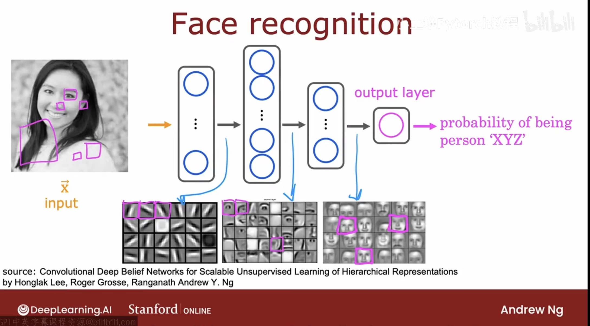
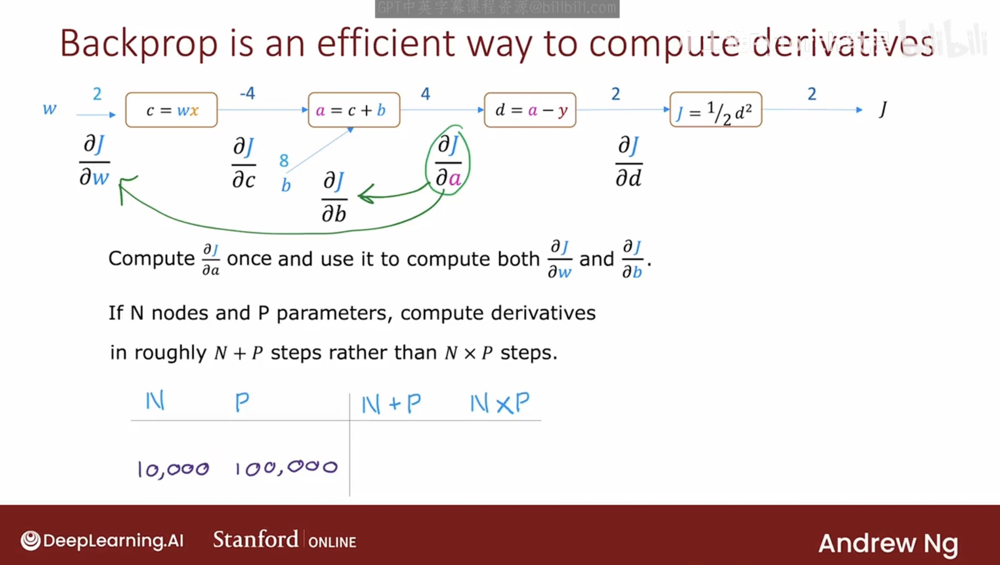

# 1. What is Neural Network

A neural network is a computational model consisting of layers of interconnected nodes that learn representations of data by updating weights during training. It approximates complex functions for tasks like classification, regression, and pattern recognition.

A single function with input x and output y is called a neuron, a stack of neuros is called a layer in neural network. Notice those layers are usally invisible, that's why they are called hiden layers



For each layer, it will take output of last layer as input. That's why it called **Forward Propagtion**

$$a_j^[l] = g( w_j^[l] · a^[l-1] + b_j^[l] )$$
where  g is the activation function


# 2. Example of Face Recoginition 

Notice for the output of each layer, the first layer will output smaller size of image such as a line or a node, while second layer will output bigger parts of face such as eyes, ears, etc. And the final layer will output entire face



# 3. Model Training Steps

## 1. Define the Model
Specify how to compute the output given input x and parameters w, b.

Model:  
$f_{w,b}(x)$

### Logistic Regression
```
z = np.dot(w, x) + b  
f_x = 1 / (1 + np.exp(-z))
```
### Neural Network (TensorFlow)
```
model = Sequential([
    Dense(...),
    Dense(...),
    Dense(...)
])
```
---

## 2. Specify Loss and Cost

### Single-Example Loss
L(f_{w,b}(x), y)

### Cost Over m Examples
$$J(w, b) = (1/m) Σ L(f_{w,b}(x^(i)), y^(i))$$

### Logistic Loss
```
loss = -y * np.log(f_x)  
       -(1 - y) * np.log(1 - f_x)
```

### Binary Cross Entropy (Neural Network)
model.compile(
    loss = BinaryCrossentropy()
)

---

## 3. Train the Model

### Logistic Regression Updates
$w = w - α * dJ/dw$

$b = b - α * dJ/db$

### Neural Network Training
model.fit(X, y, epochs = 100)


# 4. Convolutional later

Definiton: Each neuron only looks at part of previous layer's outputs.

Why: 
- Faster computation
- Less overfitting
- Need less training data 

# 5. Backdrop

