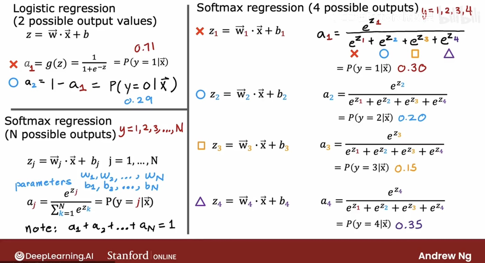
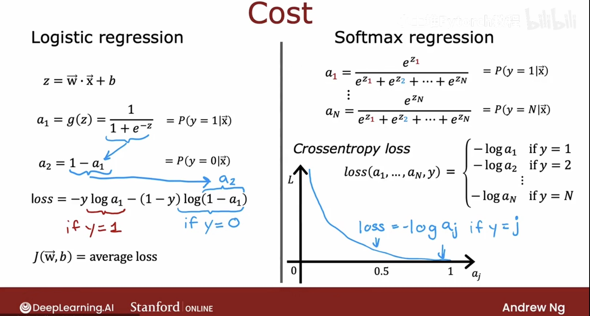

# Softmax Regression

---

# 1. Logistic Regression (2 Possible Output Values)

## Model
$z = w · x + b$

$a₁ = g(z) = 1 / (1 + e^(−z)) = P(y = 1 | x)$

$a₂ = 1 − a₁ = P(y = 0 | x)$

---

# 2. Softmax Regression (N Possible Output Classes)

For j = 1, 2, …, N:

$zⱼ = wⱼ · x + bⱼ$

$$aⱼ = e^(zⱼ) / ( Σₖ e^(zₖ) ) = P(y = j | x) $$


Note:  
a₁ + a₂ + … + aₙ = 1

### Example (4 classes: y = 1, 2, 3, 4)

$a₁ = e^(z₁) / (e^(z₁) + e^(z₂) + e^(z₃) + e^(z₄))  $

$a₂ = e^(z₂) / (e^(z₁) + e^(z₂) + e^(z₃) + e^(z₄))  $

$a₃ = e^(z₃) / (e^(z₁) + e^(z₂) + e^(z₃) + e^(z₄)) $ 

$a₄ = e^(z₄) / (e^(z₁) + e^(z₂) + e^(z₃) + e^(z₄))$





---

# 3. Logistic Regression Cost Function

## Predictions
a₁ = P(y = 1 | x)  
a₂ = 1 − a₁ = P(y = 0 | x)

## Loss (for a single example)
loss = − y log(a₁) − (1 − y) log(1 − a₁)

If y = 1 → loss = −log(a₁)  
If y = 0 → loss = −log(1 − a₁)

## Cost Function
J(w, b) = average loss

---

# 4. Softmax Regression Cost (Cross-Entropy)

aⱼ = P(y = j | x)

## Cross-Entropy Loss
```
loss(a₁, …, aₙ, y) =
    − log(a₁)  if y = 1
    − log(a₂)  if y = 2
    …
    − log(aₙ)  if y = N
```
General form:  
$loss = −log(aⱼ) $where j is the correct class.




# 5. Numerical Roundoff Errors

More numerically accurate implementations of logistic and softmax losses avoid computing probabilities `a` directly, and instead use logits `z` for improved stability.

---

# 1. Logistic Regression: Numerical Accuracy

## Sigmoid
a = g(z) = 1 / (1 + e^(−z))

## Original Loss (unstable)
loss = − y log(a) − (1 − y) log(1 − a)

This is unstable because:
- When a ≈ 1, log(1 − a) → log(0)  
- When a ≈ 0, log(a) → log(0)

## More Accurate Loss (computed using z)
loss = − y log( 1 / (1 + e^(−z)) )
       − (1 − y) log( 1 − 1 / (1 + e^(−z)) )

Modern libraries compute this using logits directly.

## Keras Implementation
Instead of:
model.compile(loss = BinaryCrossEntropy())

Use:
model.compile(loss = BinaryCrossEntropy(from_logits = True))

---

# 2. Softmax Regression: Numerical Accuracy

## Softmax
(a₁, …, aₙ) = g(z₁, …, zₙ)

aⱼ = e^(zⱼ) / ( e^(z₁) + ... + e^(zₙ) )

## Original Cross-Entropy Loss (unstable)
Loss(a, y) =
    −log(a₁)  if y = 1
    ...
    −log(aₙ)  if y = N

## More Accurate Loss (using logits)
L(a, y) =
    −log( e^(zⱼ) / ( e^(z₁) + ... + e^(zₙ) ) )  where y = j

This avoids computing softmax probabilities directly, improving numerical stability.

## Keras Implementation
Instead of:
model.compile(loss = SparseCategoricalCrossEntropy())

Use:
model.compile(loss = SparseCategoricalCrossEntropy(from_logits = True))

---

# Key Idea
- Computing loss using the raw logits `z` avoids numerical issues caused by extremely small or large values in probabilities.
- Always use `from_logits = True` when the final layer does **not** apply softmax or sigmoid.


