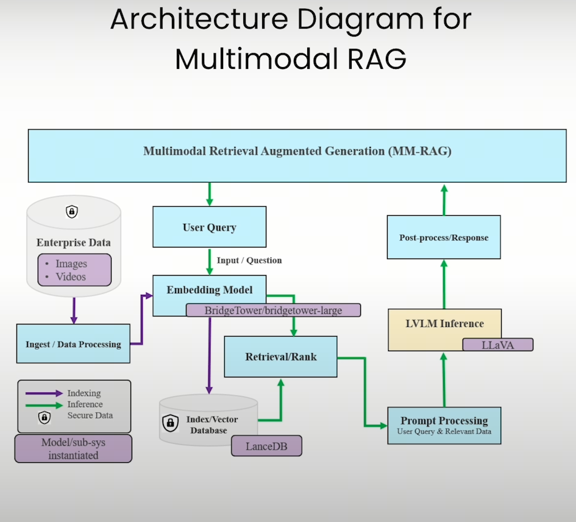

# 如何处理多模态RAG

## 1. 数据架构

1. 将图片/视频转化成 image-text pair
2. 将得到的 image-text pair转化为embedding 存入到向量库
3. 将query转化成embedding 并在向量库中retrieval
4. 将返回的image-text pair 和 query结合起来， 用LVLM得到回答
 
## 2.数据处理

对于多模态模型，可能遇到两种数据类型：视频和图片。对于视频，可以看作一帧一帧的图片拼凑而成。

对于视频，我们可能遇见3种情况：

- case1：视频有字幕
- case2：视频无字幕
- case3： 视频无字幕，且无法生成字幕，例如默片或者只有背景音乐的视频

对于图片，我们可能遇见两种情况：

- 图片带解释性文字
- 图片无解释性文字

视频处理的方法：
1. case1：我们使用某些工具，比如CV2，将视频按时间切片，选取合适的图片，并将字幕配到合适的图片上
2. case2：我们先用语音转文字的工具，如whisper，生成字幕，再用case1的方案
3. case3：使用case1的方式生成图片，再使用Large Vision-Language Model（LVLM）来生成描述，字幕

图片处理的方法：

1. case1：无需操作
2. case2：使用 Large Vision-Language Model（LVLM）来生成描述

## 3. Embedding

我们可以将上述的图片-文字对，输入到一个特殊的embedding模型，如Bridge tower 模型，这样可以得到这个pair的embedding，便于后续retrieval.

## 4. Retrieval，Prompt process & Response

将用户的query进行retrieval后，我们会得到image-text pair， 我们将query，text，image处理好，输入上文提到的LVLM中，得到response。
