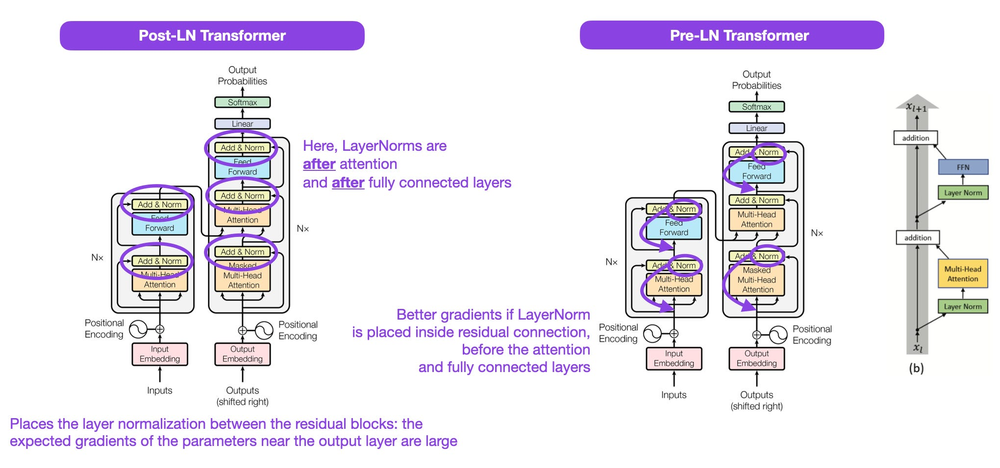

## Post-LayerNorm（原始 Transformer，2017）

**结构顺序：**  
先做子层 → 残差 → 再 LayerNorm

**数学形式：**

\[
y = \mathrm{LN}(x + F(x))
\]

---

## Pre-LayerNorm（现代主流）

**结构顺序：**  
先 LayerNorm → 再子层 → 残差

**数学形式：**

\[
y = x + F(\mathrm{LN}(x))
\]

---

## 2️⃣ 表面看很像，本质差别在梯度路径

这是理解 **Pre-LN** 的关键点。

---

## 3️⃣ Post-LN 的核心问题：梯度被 LN 截断

**Post-LN 反向传播：**

\[
\frac{\partial y}{\partial x}
=
\frac{\partial \mathrm{LN}(x + F(x))}{\partial x}
\]

也就是说：

- 梯度必须穿过 **LayerNorm**
- LN 内部包含：
  - 均值
  - 方差
  - 除法运算

👉 在深层网络中：
- 梯度容易缩小  
- 深度 ↑ → 训练不稳定  
- 需要 warm-up、小学习率、技巧堆叠  

这也是 **原始 Transformer 很难训练超过 12 层** 的原因之一。

---

## 4️⃣ Pre-LN 的核心优势：梯度高速公路

**Pre-LN 的残差路径：**

\[
y = x + F(\mathrm{LN}(x))
\]

**反向传播时：**

\[
\frac{\partial y}{\partial x}
=
1 + \frac{\partial F}{\partial x}
\]

🚀 **恒等映射（identity path）永远存在**

- 即使 \(F\) 的梯度很小  
- 也始终存在一条 **不经过 LN 的梯度通路**

👉 **这是深层 Transformer 能稳定训练的关键**

---

## 5️⃣ 为什么 GPT、BERT-large、LLM 全选 Pre-LN？

| 模型 | LN 类型 | 原因 |
|----|----|----|
| 原始 Transformer | Post-LN | 当时没意识到深层问题 |
| BERT-base | Post-LN | 12 层还能撑住 |
| BERT-large | ❌ 很难训 | Post-LN + 深层 |
| GPT-2 / GPT-3 / LLaMA | ✅ Pre-LN | 稳定、可扩展 |
| 现代 LLM（>24 层） | ✅ Pre-LN | 必须 |

**一句话：**

> 没有 Pre-LN，就没有 100+ 层 Transformer。

---

## 6️⃣ 数值稳定性对比（非常重要）

### Post-LN
- Sublayer 输出尺度不可控  
- LN 在最后“强行拉回”  
- 残差 + LN 相互拉扯  

### Pre-LN
- 输入先被 LN 标准化  
- Attention / FFN 都在 **稳定输入分布** 上工作  
- 输出再加回原始 \(x\)，语义保留  

👉 **Attention 尤其依赖 Pre-LN**

---

## 7️⃣ 训练技巧差异（工程视角）

| 项目 | Post-LN | Pre-LN |
|----|----|----|
| 需要 warm-up | ✅ 强依赖 | ❌ 可有可无 |
| 学习率 | 小 | 大 |
| 深度扩展 | 差 | 极好 |
| 收敛速度 | 慢 | 快 |
| 梯度爆炸 | 常见 | 极少 |

---

## 8️⃣ Pre-LN 没缺点吗？

有，但 **可控**。

❌ **问题：表示可能“漂移”**

原因：

\[
y = x + F(\mathrm{LN}(x))
\]

- \(x\) 本身没有被归一化  
- 层数很深时，尺度可能逐渐变大  

**工程解决方案：**
- Final LayerNorm（GPT 使用）
- RMSNorm（LLaMA 使用）
- Residual scaling（DeepNet）

---

## 9️⃣ 直觉类比（很好记）

- **Post-LN**：  
  > “先把东西弄乱，再整理”
- **Pre-LN**：  
  > “先整理好，再加工”

👉 在深度网络中，**先整理一定更安全**

---

## 🔟 面试 / 考试 30 秒标准答案

> Pre-LN 将 LayerNorm 放在子层之前，使残差路径形成恒等映射，从而保证梯度可以不经过归一化直接传播，显著提升深层 Transformer 的训练稳定性和可扩展性；而 Post-LN 的梯度必须穿过 LayerNorm，深层时容易不稳定，因此现代大模型几乎全部采用 Pre-LN。
